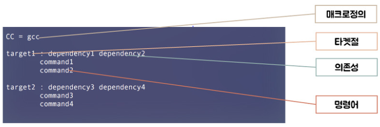
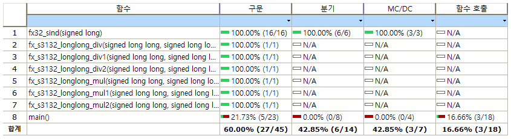
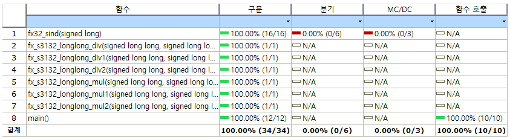

# fx_s3132

# 실전코딩 2

# TEAM 4 : 이상경 한정우 배우진 황정목

# fixed point calculator(s3132)

### In this project various operation related to fixed point can be performed

# project - STEP 1
### 1. list of functions
- a. ADD ( + )
- b. SUB ( - )
- c. MUL ( x )
- d. DEV ( / )
- e. CONVERSIONS ( type1 -> type2 )

### 2. concept of fixed point
- 
- a. data types in computer langauge always have fixed length
- b. in fixed point decimal point position of specific number should be fixed
- c. mean of s3132
  - s(sign) / 31(interger) / 32(decimal point)
  - first s bit is used for number's sign (+ or -)
  - second 31bits are used to represent interger part
  - third 32bits are used to represent decimal

### 3. difference between fixed point and floating point
- a. fixed point
  - in fixed point decimal point position of specific number should be fixed
- b. floating point
  - in floating point decimal point position of specific number can be flexible

### 4. explanation of functions
- a. calculations
  - 1. add (a) + (b)
    ~~~
    #define fx_add(a, b) ((a)+(b))
    ~~~
    - to add two fixed point numbers there is no need to conversion of data type
    - just add two fixed point numbers and return result

  - 2. sub (a) - (b)
    ~~~
    #define fx_sub(a, b) ((a)-(b))
    ~~~
    - to sub one fixed point number from another fixed point number there is no need to conversion of data type.
    - just operate function without conversion of data type and return result

  - 3. mul (a) * (b)
    ~~~
    #define fx_mul(a, b) double_to_fx(fx_to_double (a) * fx_to_double (b))
    ~~~
    - to mul two fixed pouint number shoul do type conversion
    - first convert two fixed point number to double type and do mul operation
    - second result calculated from first step should be converted to fixed point number(type conversion)

  - 4. div (a) / (b)
    ~~~
    #define fx_div(a, b) double_to_fx(fx_to_double (a) / fx_to_double (b))
    ~~~
    - to div two fixed pouint number shoul do type conversion
    - first convert two fixed point number to double type and do div operation
    - second result calculated from first step should be converted to fixed point number(type conversion)

- b. type conversion 
  - 1. fixed point -> double
    ~~~
    #define fx_to_double(a) (a/P2_2to32)
    ~~~
    - to convert fixed point to double should divide fixed point number by 2^32(s31(32)=>decimal part bits)

  - 2. double -> fixed point
    ~~~
    #define double_to_fx(a) (long long)(a*P2_2to32)
    ~~~
    - to convert double to fixed point should multiply double number and 2^32(s31(32)=>decimal part bits)

- c. some operation related to math library
  - 1. sin
    ~~~
    #define fx_sin(a) double_to_fx(sin(fx_to_double(a)))
    ~~~
    - to convert fixed point number to sine value there is need to type conversion
    - first convert fixed number to double
    - second do sine operation with math library
    - thrid conver result calculated by second step to double and return result

  - 2. sqrt
    ~~~
    #define fx_sqrt(a) double_to_fx(sqrt(fx_to_double(a)))
    ~~~
    - to do sqrt operation with fixed point number there is need to type conversion
    - first convert fixed number to double
    - second do sqrt operation with math library
    - thrid conver result calculated by second step to double and return result

  - 3. power
    ~~~
    #define fx_power(a, b) double_to_fx(pow(fx_to_double(a), fx_to_double(b)))
    ~~~
    - to do power operation with fixed point number there is need to type conversion
    - first convert fixed number to double
    - second do sqrt operation with math library
    - thrid conver result calculated by second step to double and return result

# project - Makefile

## concept
- maintain, update, and regenerate group of programs
- tool that helps to efficiently maintain and consistently manage large-scale programs composed of many program modules.
- Object file creation, library creation, execution file creation from object file by determining dependency from target

  - advantages
    - Save time by automating repetitive commands for each file
    - Easy to manage and can quickly seize the subordinate structure of the program
    - Minimal repititve work and duplicated task

## configuration
- object file(Target): The output file as a result of executing the -c command
- Dependency: Files needed to create object files
- command: Required commands
- macro: Work to simplify code
- 

## macro
- $@: Current target file name
- $?: List of dependency files updated more recently than the current Target
- $*: List of current dependency files updated more recently than current target
- $<: First file name among dependency files
- $^: List of all current dependency files
- CC: Program for compiling C programs; default 'cc'
- CFLAGS: cc command option setting

## test.c Makefile
- SRCS := test.c
    ~~~
    - SRCS = test.c
    ~~~
- OBJS := $(SRCS:.c=.o)
    ~~~
    - .c파일 -> .o파일
    ~~~
- CC := gcc
    ~~~
    - CC 매크로를 gcc로 설정
    ~~~
- CFLAGS := -c -Wall
    ~~~
    - 모든 c파일들을 warning 포함해서 컴파일
    ~~~
- fx_3132 : $(OBJS)
    ~~~
    - fx_3132라는 이름으로 OBJS파일들 컴파일 하여 출력
    ~~~
- $(CC) -o $@ $^ -lm
    ~~~
    - test로 dependency파일들 math.h 라이브러리 불러와서 모두 컴파일 하여 출력
    ~~~
- clean :
	- rm $(OBJS)
	    ~~~
        - OBJS를 통해 만든 모든 .O 파일 삭제
        ~~~
	- rm fx_3132
	    ~~~
        - fx_3132 파일 삭제
        ~~~
- dep :
	- gccmakedep $(SRCS)
	    ~~~
        - SRCS 관련된 dependency 파일 모두 검색
        ~~~

# project - STEP 2
### 1. list of functions
- a. MUL ( x )
- b. DIV ( / )
- c. SINE

### 2. explanation of fuctions
- a. mul
  - fx32_mul
  ~~~
  ((fa * fb) >> FX32_QNUM ) 
  ~~~
     1. fuction that multiplies fa and fb and divides it by 2^32
  - fx32_mul1
  ~~~
  ((fa>>16) * fb)>>16)
  ~~~
     1. Same as fx32_mul, the same fuction as fa*fb>>32, first multiply fa/2^16 and fb, and divide the remaining 2^16
  - fx32_mul2
  ~~~
  (((fa>>8)*(fb>>8))>>16)
  ~~~
     1. Same as above, the same fuction as fa*fb>>32, first multiply fa/2^8, fb/2^8, and divide the remaining 2^16
- b. div
  - fx32_div
  ~~~
      ( (((fixed64)(fa) << FX32_QNUM) /(fb))) 
  ~~~
     1. fuction that multiplies fa by 2^32 and divides fb.
  - fx32_div1
  ~~~
  ((((fa)<<16)/(fb))<<16)
  ~~~
     1. Same as above, it has the same fuction as (fa<<32)/fb. First, fa is multiplied by 2^16 and divided by fb, and then the remaining 2^16 is multiplied
  - fx32_div2
  ~~~
  ((((fa)<<24)/(fb))<<8)
  ~~~
     1. same as above, it has the same fuction as (fa<<32)/fb. First, fa is multiplied by 2^24, divided by fb, and then the remaining 2^8 is multiplied.
- c. sin
  - sin table
  ~~~
  const fixed32 fx32_SinTable[92] =  
    {     
        0,1143,2287,3429,4571,5711,6850,7986,9120,10252,11380,12504,13625,14742,15854,16961,18064,19160,20251,21336,22414,23486,24550,25606,26655, 27696,28729,29752,
        30767,31772,32768,33753,34728,35693,36647,37589,38521,39440,40347,41243,42125,42995,43852,44695,45525,46340,47142, 47929,48702,49460,50203,50931,51643,52339,
        53019,53683,54331,54963,55577,56175,56755,57319,57864,58393,58903,59395,59870,60326,60763, 61183,61583,61965,62328,62672,62997,63302,63589,63856,64103,64331,
        64540,64729,64898,65047,65176,65286,65376,65446,65496,65526,65536,65526
    };
  ~~~
  - sin fuction 
  ~~~
  fixed32 fx32_sind(fixed32 fa) 
  {
    int sign = 1;   
    fixed32 ret0, diff;
    int idx; 
    if ( fa < 0 ) 
    {
        sign = -1;
        fa *= -1; 
    }
    fa = fa % FX32_360; 
    if ( fa >= FX32_180 ) 
    {
        sign *= -1;
        fa -= FX32_180;
    }
    if ( fa > FX32_90 ) 
        fa = FX32_180 - fa;
    idx = fa>>16; 
    ret0 = fx32_SinTable[idx]; 
    diff = fx32_SinTable[idx+1]-ret0;
    return ( sign *( ret0 + ((diff*(fa&0xFFFF))>>16) )); 
  }
  ~~~
    - with using sine table and sine function can derive the appropriate sine value.
    - there are four part in sine function because it is divided from the 1st quadrant to the 4th quadrant according to the sine value.
      - a. angle with negative value
      ~~~
      if ( fa < 0 ) 
      {
        sign = -1;
        fa *= -1; 
      }
      ~~~
      - b. 3th, 4th quadrant
      ~~~
      if ( fa >= FX32_180 ) 
      {
        sign *= -1;
        fa -= FX32_180;
      }
      ~~~
      - c. 2th quadrant
      ~~~
      if ( fa > FX32_90 ) 
        fa = FX32_180 - fa;
      ~~~

### 3. speed vertification review
- a. mul
  ~~~
  Each sample counts as 0.01 seconds.
  %   cumulative   self              self     total           
  time   seconds   seconds    calls  ns/call  ns/call  name    
  29.82      0.34     0.34 10000000    34.00    34.00  fx_s3132_longlong_mul1
  29.82      0.68     0.34                             main
  21.93      0.93     0.25 10000000    25.00    25.00  fx_s3132_longlong_mul2
  18.42      1.14     0.21 10000000    21.00    21.00  fx_s3132_longlong_mul
  ~~~
  - It can be seen that the speed is different for each fuction.
  - fuction that multiplies fa and fb and divides it by 2^32 is fatest.
  - from the above result, it can be seen that there is a difference in call speed depending on how the shift operation is used.

- b. div
  ~~~
  Each sample counts as 0.01 seconds.
  %   cumulative   self              self     total           
  time   seconds   seconds    calls  ns/call  ns/call  name    
  78.05      3.45     3.45                             __udivmoddi4
  5.43      3.69     0.24                             __aeabi_ldivmod
  5.20      3.92     0.23                             main
  4.98      4.14     0.22 10000000    22.00    22.00  fx_s3132_longlong_div1
  4.30      4.33     0.19 10000000    19.00    19.00  fx_s3132_longlong_div2
  2.04      4.42     0.09 10000000     9.00     9.00  fx_s3132_longlong_div
  ~~~
  - It can be seen that the speed is different for each fuction.
  - fuction that multiply fa by 2^32 and divides fb is fatest.
  - from the above result, it can be seen that there is a difference in call speed depending on how the shift operation is used.
- c. summary
  - It can be seen that the speed of each function appears differently depending on the number calculated or other situations.
  - If making good use of the shift operation, can create a function that is optimized for each situation.

# project - STEP 3
## 1. Software Requriement Specification
## 2. Reduction of violation

- Change of violation
  - Violation 89 -> 48
- Modified content
  - Result value of function is not used, so Add return value.
  - Function declarartion doesn't exist before definition.
  - Add parentheses to parameters.
  - Add void parameter to main function.
  - Declare mul, div function as static.

- Unsolved content
  - problem of bitwise operator.
  - printf is a fobidden function.
  - some macros are forbidden.

# Dynamic Test(fx_s3132)

## Code Coverage
    - One of the indicators of how much testing is sufficient when discussing software testing.

## Project Coverage (60% -> 100%)
### Before

### After

